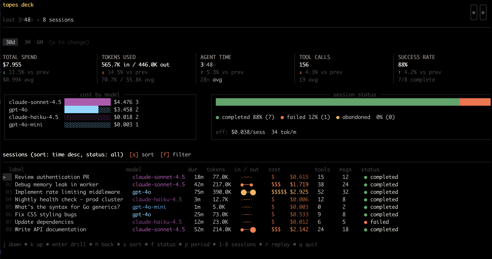
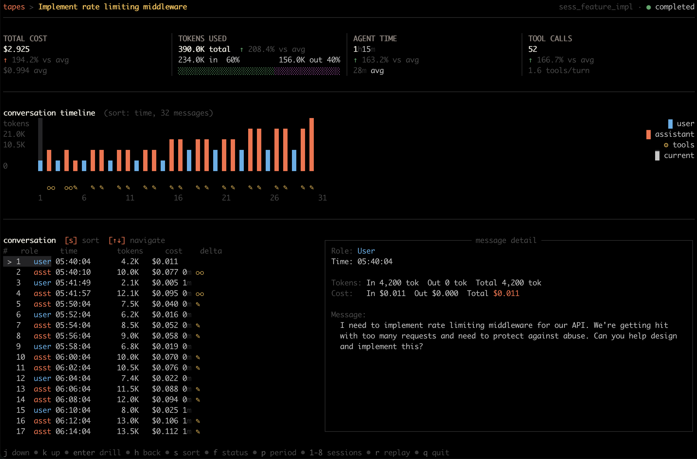

# Deck

Deck is a terminal ROI dashboard over sessions, traces, and spans. It summarizes cost, token use, duration, models, tool calls, and derived status, then drills into a session's conversation timeline.

```bash
tapes deck
```

Deck reads the running API at `http://localhost:8081` by default. To explore without capturing an agent first:

```bash
tapesctl seed --tapes-url http://localhost:8081
tapes deck
```



## Filter and sort

```bash
tapes deck --since 24h
tapes deck --from 2026-01-30 --to 2026-01-31
tapes deck --sort cost --sort-dir desc
tapes deck --model claude-sonnet-4.5
tapes deck --project my-app --status failed
tapes deck --session <session-id>
tapes deck --refresh 10
```

Accepted sort keys are `cost`, `date`, `tokens`, and `duration`. Status filters are `completed`, `failed`, and `abandoned`. Use `--pricing ./pricing.json` to override pricing data and `--theme dark|light` when automatic terminal theme detection is wrong.

## Navigation

The footer displays context-sensitive keys. Common controls include:

| Key | Action |
| --- | --- |
| `j` / `k` or arrows | Move selection or scroll |
| `Enter` | Drill into the selected session or group |
| `h` or `Esc` | Return to the previous view |
| `s` | Change sort |
| `f` | Filter status |
| `/` | Search session labels |
| `p` | Cycle time periods |
| `r` | Replay the conversation timeline |
| `n` | Load more sessions |
| `q` | Quit |



Deck has no `--demo` or `--web` mode. Seed with `tapesctl seed`; enable the separate minimal API browser UI, when wanted, with `tapes serve --api-web-ui`.
